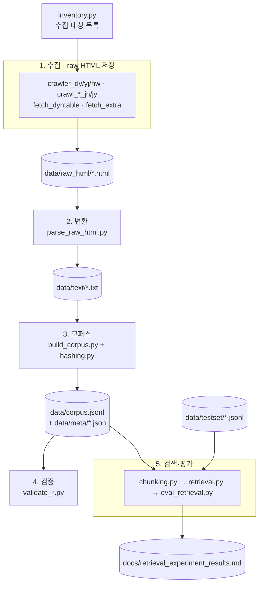

# 코드베이스 안내 (온보딩)

KDIC 안내문서 기반 한국어 RAG 챗봇의 **데이터 파이프라인 + 검색 평가** 저장소.
전체는 **수집 → 변환 → 코퍼스 → 검증 → 검색·평가** 5단계로 흐른다. 각 파일은 이 중 한 단계에 속한다.

## 한눈에 보기



## 단계별 파일

### 1. 수집 (Crawl) — 사이트에서 원본 HTML 저장
| 파일 | 역할 |
|---|---|
| `inventory.py` | **수집 대상 페이지 통합 목록**(팀원 5명 병합). "여기 있는 것만 크롤한다" — 시작점 |
| `crawler_dy.py` / `crawler_yj.py` / `crawler_hw.py` | 담당자별 크롤러 + 규칙기반 HTML→텍스트 (LLM 미사용) |
| `crawl_mistaken_remittance_jh.py` | 착오송금 도메인 크롤러 (+영상·첨부 추출) |
| `crawl_debt_adjustment_raw_html_jy.py` | 채무조정 8개 페이지 원본 HTML |
| `fetch_dyntable.py` | **동적 조회표** 수집(검색폼+페이지네이션 결과표 전체 행) |
| `fetch_extra.py` | 페이지네이션 뒷페이지 + 게시판 상세(첨부 URL) 수집 |

### 2. 변환 (Parse) — HTML → 정규화 텍스트
| 파일 | 역할 |
|---|---|
| `parse_raw_html.py` | `raw_html/*.html` → `text/*.txt` 일괄 변환. 표는 `\|` 구분 행으로 보존 (`crawler_dy.html_to_text` 재사용) |
| `paser_hw.py` | hw 담당 변환 보조 |

### 3. 코퍼스 (Build) — 텍스트+메타 → 문서 코퍼스
| 파일 | 역할 |
|---|---|
| `build_corpus.py` | `text/` + `meta/` → **`data/corpus.jsonl`** (페이지 1개 = 1줄 = 메타+본문). 파이프라인의 핵심 산출물 |
| `hashing.py` | 갱신 감지 기준 = 본문 텍스트의 `content_sha256` (HTML 아님 — 판본·세션토큰 탓에 튀므로) |

### 4. 검증 (Validate) — 산출물 일관성 체크
| 파일 | 역할 |
|---|---|
| `validate_testset.py` | 테스트셋 ↔ 코퍼스 정합성(정답 page_id 존재, 필드 스키마 등) |
| `validate_dy.py` / `validate_yj.py` | 담당자별 HTML→텍스트 변환 검증 (네트워크 불필요) |

### 5. 검색·평가 (Retrieval / Eval) — ⭐ 최근 추가분
| 파일 | 역할 |
|---|---|
| `chunking.py` | `build_units(mode)` — 색인 단위 결정(`page`/`faq_atomic`/`table_row`/`all`). FAQ·표 탐지는 규칙 기반 |
| `retrieval.py` | **BM25 · Dense(bge-m3) · Hybrid(RRF)** 검색기 + `PageRanked`(유닛→페이지 접기) |
| `eval_retrieval.py` | 문서찾기(Recall@k·MRR) + 답뽑기(AnswerRecall) 평가 + 지표 selftest |
| `embed_corpus.py` | **임베딩 일괄 생성 단일 진입점.** 4개 모드 벡터를 `data/dense_cache/`에 저장 + `data/chunks_all.jsonl` 덤프. 한 사람이 실행·커밋하면 팀 공유 |

## 데이터 산출물 (`data/`)

| 경로 | 무엇 | 만든이 |
|---|---|---|
| `raw_html/*.html` (58) | 수집한 원본 HTML | 1단계 |
| `text/*.txt` (58) | 정규화 본문 텍스트 | 2단계 |
| `meta/*.json` (58) | 페이지별 메타(URL·카테고리·수집일·해시 등) | 3단계 |
| **`corpus.jsonl`** (58줄) | **문서 코퍼스** = 메타+본문. 검색의 입력 | 3단계 |
| `testset/testset_all.jsonl` (174) | 통합 평가셋(질문·정답 page_id·must_include) | 사람 작성 |
| `testset/testset_tail_probe.jsonl` (4) | 잘린 표 꼬리 겨냥 프로브 | 5단계 |
| **`chunks_all.jsonl`** (494줄) | **제품용 청크** = `all` 모드 유닛. `{chunk_id, page_id, source_url, page_title, business_function, text}` — 출처 인용·필터링까지 self-contained. 임베딩과 순서 일치 | 5단계 |
| `dense_cache/*.npy` (4) + `manifest.json` | **팀 공유 Dense 임베딩**(커밋됨). 파일명=내용 해시 → 코퍼스 변경 시 자동 무효화. `embed_corpus.py`로 생성 | 5단계 |

## 처음 보는 사람 — 읽기 순서

1. **`README.md`** — 프로젝트가 뭘/왜 하는지 (연구계획서)
2. **`data/corpus.jsonl` 첫 줄** — 데이터가 어떻게 생겼는지 (모든 것의 중심)
3. **`src/inventory.py`** — 무엇을 수집하는지
4. **`src/build_corpus.py`** docstring — 코퍼스가 어떻게 만들어지는지
5. **`src/eval_retrieval.py`** + **`docs/retrieval_experiment_results.md`** — 검색을 어떻게 평가/비교하는지

## 자주 쓰는 실행 커맨드

```bash
# 코퍼스 재생성 (네트워크 불필요, 로컬 raw_html 사용)
python3 src/build_corpus.py

# 텍스트 변환만 다시
python3 src/parse_raw_html.py

# 테스트셋 정합성 검증
python3 src/validate_testset.py

# 검색기 비교 평가 (BM25/Dense/Hybrid × 색인단위) — 첫 실행 시 bge-m3 다운로드
python3 src/eval_retrieval.py

# 임베딩 + 제품 청크 재생성 (코퍼스 갱신 후 실행 → data/dense_cache/ 와 chunks_all.jsonl 재커밋)
python3 src/embed_corpus.py

# 개별 모듈 자가검증
python3 src/chunking.py      # 청킹 단위 수 확인
python3 src/hashing.py       # 해시 자체검사
```

## 제품(챗봇)이 실제로 쓰는 것
검색 실험 산출물 중 **챗봇 런타임이 쓰는 건 `all` 모드 한 세트**다:
- `data/dense_cache/2498028…npy` (494 벡터) + `data/chunks_all.jsonl` (494 청크 텍스트) + bge-m3 모델(질문 인코딩용).
- 나머지 3개 모드(page/faq_atomic/table_row)는 "청킹이 왜 필요한지" 증명한 **실험 비교군**이지 제품용이 아니다. 근거는 `docs/retrieval_experiment_results.md`.

## 참고
- 크롤러가 담당자별로 나뉜 건 팀원 5명이 업무 기능을 나눠 수집했기 때문 (`inventory.py` 상단 owner 매핑 참고).
- 변환은 **전부 규칙 기반**(LLM 미사용) — 원문 보존·재현성이 원칙.
- **크로스 플랫폼(맥·윈도우):** 모든 텍스트 파일 I/O는 `encoding="utf-8"` 명시(윈도우 기본 cp949로 한글 깨짐 방지), `.gitattributes`가 `.jsonl` 줄바꿈을 LF로 고정(CRLF면 공유 임베딩 캐시 해시가 틀어짐).
- 파이프라인 시각 자료는 `docs/pipeline.html`, 검색 실험 결과는 `docs/retrieval_experiment_results.md` 에 있음.
