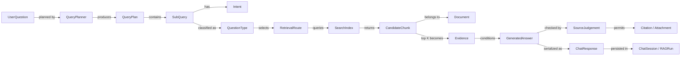

# KDIC 프로젝트 LLM Wiki

> 종류: **Current**  
> 기준: `ontology/approved-work` 작업 트리, 2026-08-12 (미커밋)  
> 목적: 사람과 LLM이 현재 코드의 구조, 개념, 실행 흐름, 변경 영향을 빠르게 파악하는 진입점

## 1. 프로젝트 한 문장

예금보험공사(KDIC) 공개 안내문을 수집·정규화·색인하고, 검색 근거에 기반해 답하는 한국어 RAG
챗봇과 그 데이터·운영 관리 화면을 만드는 프로젝트다.

주요 사용자는 두 종류다.

- 일반 사용자: 예금자보호, 착오송금 반환지원, 채무조정 등 KDIC 업무를 질문한다.
- 운영자: 지식 페이지, 수집 미리보기, 파이프라인 작업, 활동 로그와 운영 설정을 관리한다.

## 2. 이 문서와 ontology의 관계

이 문서는 **프로젝트 구현 Wiki**다. 코드 구조와 실행 흐름의 설명·탐색이 목적이며, 아래의 “개념 관계 지도”만 경량 ontology 역할을 한다. KDIC 업무 지식을 LLM이 탐색하는 실제 도메인 Wiki는 [`../ontology/llm-wiki/`](../ontology/llm-wiki/)에 별도로 생성한다.

- 프로젝트 구현 Wiki: 무엇이 어디에 있고 어떻게 동작하는지 설명한다.
- 업무 LLM Wiki: 질문에 맞는 KDIC 업무영역과 공식 원문을 찾는 한글 안내서다. 답변의 정본은 여전히 공식 원문이다.
- Ontology: 개념의 종류, 관계, 제약을 형식적으로 정의한다.
- Knowledge graph: ontology를 사용해 실제 문서·청크·질문·답변 인스턴스를 연결한다.

정식 RDF/OWL 서버는 도입하지 않았지만, 현재 코퍼스에 매핑되는 기계 판독 ontology를
[`ontology/kdic-domain-ontology.yaml`](../ontology/kdic-domain-ontology.yaml)으로 관리한다. 이는
개념·관계·근거 규칙의 정본이며, 아직 런타임 검색이나 답변 생성에 자동 적용되지는 않는다.
적용 절차는 [`ontology/README.md`](../ontology/README.md)에 있다.

v1은 58개 문서를 6개 Service와 95개 메타데이터 Concept에 결정론적으로 연결한
`ontology/kdic-document-concept-map.json`이다. 생성기는 `src/crawler/build_ontology_map.py`이며,
중간 매핑은 `unreviewed`로 유지하고 실제 사람 검토 결과는 별도 canonical 계층에 보존한다.

정제 결과는 `ontology/kdic-canonical-ontology-draft.json`의 entity 45개와
`ontology/kdic-core-fact-proposals.json`의 source-verified fact 15개,
`ontology/kdic-official-label-aliases.json`의 공식 label 47개로 통합된다. 이들을 연결한
`ontology/kdic-canonical-graph.json`은 177 nodes·307 relations이며 Obsidian과 Neo4j export의 입력이다.
entity 45개와 core fact 15개의 도메인 승인은 `ontology/review/canonical-ontology-decisions.json`에
기록되어 있다. 공식 label 47개와 보강 fact 후보 6개도 별도 결정 파일에서 모두 승인됐다. 다만
contextual label은 동의어가 아니며, 보강 후보는 core fact 승격 전까지 답변 값이 아니다. YAML의 12개 canonical
class와 6개 relation은 실제 graph와 자동 대조한다. 검색 품질 게이트가 아직 끝나지 않았으므로
여전히 운영 검색·답변 근거로 자동 사용할 수 없다.
최종 자동 판정은 `results/ontology/release_readiness.json`을 확인한다.

## 3. 사실의 정본

| 알고 싶은 것 | 우선 확인할 곳 |
|---|---|
| 현재 실행 동작 | 코드와 테스트 |
| 웹 API 형식 | `api/schemas/` + `web/src/lib/api/types.ts` |
| SSE 이벤트 | `api/rag/sse.py` + `web/src/lib/api/chat.ts` |
| 데이터 필드 | `docs/metadata_schema.md` |
| 프론트 목 계약 | `web/src/mocks/README.md` |
| 현재 문서 목록 | `docs/README.md`의 Current 표 |
| 과거 결정과 실험 | Historical 문서와 `log/` |

충돌 시 `코드/테스트 → 계약 스키마 → Current 문서 → Historical → log` 순으로 신뢰한다.

## 4. 시스템 지도

```text
KDIC 웹사이트
  → src/crawler/            수집·파싱·청킹·검증·적재
  → data/                   원본, 정규화 문서, 평가셋, 캐시
  → Supabase Postgres       문서·청크·벡터·대화·운영 데이터
  → src/ RAG core           계획·분류·검색·프롬프트·생성·출처 판정
  → api/ FastAPI            SSE 채팅, 세션, 피드백, 관리자 API
  → web/ React              사용자 챗봇과 관리자 화면
```

| 영역 | 핵심 경로 | 책임 |
|---|---|---|
| 데이터 파이프라인 | `src/crawler/` | KDIC 페이지 수집, 텍스트 정규화, 코퍼스/청크 생성, 평가, DB 적재 |
| RAG 코어 | `src/` 루트 | 질의 계획, 의도/유형 분류, 검색, 후보 절단, 프롬프트, LLM 호출, 출처 조립 |
| API | `api/` | HTTP/SSE 계약, 인증, 세션, 피드백, 관리자 기능, 오류·미들웨어 |
| 프론트엔드 | `web/` | React 챗봇, 관리자 화면, API client, MSW 계약 목 |
| 데이터 | `data/` | raw HTML, 텍스트, 메타데이터, 코퍼스, 테스트셋, 평가용 캐시 |
| 인프라 | `infra/` | 선택적인 로컬 Postgres 개발 환경. 운영 정본은 Supabase |
| 결정 기록 | `docs/`, `log/` | Current 문서, 실험 이력, 일일 기록 |

## 5. 경량 ontology — 개념과 관계

### 5.1 RAG 개념 그래프



### 5.2 핵심 개념 사전

| 개념 | 코드/데이터 표현 | 의미와 제약 |
|---|---|---|
| UserQuestion | `ChatRequest.message` | 공백 제외 최대 500자 |
| QueryPlan | `query_planner.QueryPlan` | 분해 여부와 하나 이상의 `PlanItem` |
| SubQuery | `PlanItem.question` | 복합 질문을 독립 검색 가능한 단위로 나눈 것 |
| Intent | `informational`, `civil_petition` | 답변 조립 방식과 첨부 형식을 결정 |
| QuestionType | `fact`, `faq`, `table_lookup`, `link_guide`, `file_download`, `out_of_scope` | 검색 라우팅과 평가 라벨. 런타임에서는 주로 `link_guide` 여부를 사용 |
| BusinessFunction | 6개 KDIC 업무 분류 | 메타데이터·화면 분류에 사용. 검색 hard filter는 현재 Off |
| Document | DB `documents`, `corpus.jsonl`의 한 행 | KDIC 원본 페이지 하나 |
| DocumentChunk | DB `document_chunks`, `chunks_all.jsonl`의 한 행 | 검색 가능한 문서 일부. 한 Document에 속함 |
| CandidateChunk | `(chunk_id, score, text)` | 검색기가 반환하는 후보. 20개를 가져와 최종 5개 사용 |
| Evidence | 최종 `top` 청크와 민원 조립 결과 | 생성 모델에 제공되는 근거 |
| GeneratedAnswer | HyperCLOVA 출력 | 첫 줄의 `[SOURCE_USED]`/`[NO_SOURCE]` 자기보고 마커를 내부 처리 |
| SourceJudgement | `source_check.AnswerJudgement` | 근거 사용 여부와 `grounded/refusal/ungrounded_claims` 성격 |
| Citation | `SourceItem` | `page_id`, breadcrumb, title, URL. LLM이 URL을 만들지 않음 |
| Attachment | `Attachment` | 민원 답변의 필요 서류(`document`) 또는 신청 링크(`link`) |
| ChatResponse | `api.schemas.chat.ChatResponse` | SSE `done` 이벤트의 최종 계약 |
| PipelineJob | DB `pipeline_jobs` | 수집·재색인 요청 기록. 현재 실제 워커는 미구현 |

### 5.3 중요한 관계 제약

- `Document 1 ─ N DocumentChunk`
- 비활성 Document의 청크는 DB trigger로 함께 비활성화된다.
- `QueryPlan 1 ─ N SubQuery`; 단일 질문도 PlanItem 하나를 가진다.
- SubQuery마다 intent, 검색, 근거, 답변, 출처가 독립적이다.
- 복합 ChatResponse는 출처/첨부를 `sub_answers`에만 둔다. 최상위 배열은 비운다.
- Citation URL은 코퍼스 메타데이터에서 결정론적으로 가져온다. 생성 모델 출력에서 가져오지 않는다.
- `out_of_scope`는 현재 별도 범위 판정 결과가 아니라 “모든 하위 답변이 근거 미사용”인지를 대신
  사용한다. 개념적으로 완전히 같은 뜻은 아니다.

## 6. 현재 RAG 실행 흐름

### 6.1 웹 API 경로

```text
POST /api/chat
  → accepted SSE
  → 질문 저장
  → OpenAI Query Planner: 복합질문 분해 + 하위질문별 intent
  → 하위질문마다
      → 질문 유형 분류
      → Dense 검색, link_guide만 Dense+BM25 hybrid
      → 후보 20개
      → reranker 생략
      → 상위 5개
      → top-1 < 0.35면 근거 비움
      → informational/civil_petition 프롬프트 조립
      → HyperCLOVA 토큰 스트리밍
      → 첫 줄 source marker 제거
      → 필요 시 OpenAI source judgement
      → 출처·첨부 확정
  → done SSE
  → rag_runs와 대화 저장
```

핵심 파일은 다음과 같다.

| 단계 | 파일 |
|---|---|
| HTTP 진입 | `api/routers/chat.py` |
| SSE 조립 | `api/rag/sse.py` |
| 하위질문 준비/확정 | `api/rag/answer.py` |
| 계획 | `src/query_planner.py` |
| 질문 유형·폴백 intent | `src/query_classifier.py` |
| 검색 | `src/retrieval.py` |
| 후보 절단·게이트 | `src/candidate_ranking.py` |
| 프롬프트/마커 | `src/prompt_builder.py` |
| LLM 연결 | `src/llm_client.py` |
| 출처 재판정 | `src/source_check.py` |
| 출처/민원 첨부 | `src/citation.py`, `src/civil_petition.py` |

`answer_delta`는 사용자에게 먼저 보이는 스트림이고 `done`은 최종 정본이다. 사후 판정이 환각
본문을 교체하거나 재생성본을 채택할 수 있으므로 두 본문이 항상 같다고 가정하면 안 된다.

### 6.2 CLI/Streamlit 경로

`src/pipeline.py`의 `rag_answer()`가 조립한다. 웹 API와 같은 빌딩블록을 쓰지만 별도 구현이다.
웹은 구조화 응답과 스트리밍이 필요해 이 함수를 직접 호출하지 않는다.

| 차이 | 웹 API | CLI/Streamlit |
|---|---|---|
| 오케스트레이터 | `api/rag/answer.py`, `sse.py` | `src/pipeline.py` |
| 출력 | `ChatResponse` + SSE | 문자열 |
| `[NO_SOURCE]` 재판정 | 3회 병렬 다수결 | 단일 재판정 |
| 거절 재생성 | 조건부 1회 | 없음 |

따라서 K값, 스위치, 게이트, 프롬프트 계약을 바꾸면 두 경로를 함께 수정·검증해야 한다.

### 6.3 LLM 호출 비용 모델

단일 질문의 일반 경로는 대략 `planner 1 + generation 1 = 2회`다. `[NO_SOURCE]` 경로의 웹 API는
다수결 판정 3회가 추가되고, 거절 복구 시 생성 1회와 최대 판정 3회가 더 붙을 수 있다. 복합 질문은
planner는 한 번이지만 생성·판정 비용이 하위질문 수만큼 늘어난다.

테스트 통과는 이 비용이나 실제 정확도 개선을 증명하지 않는다. 변경 비교 시 같은 held-out 세트에서
다음을 함께 기록한다.

- 질문당 호출 수와 입력/출력 토큰
- 검색 Recall@5, MRR, AnswerRecall
- 답변 정확도와 출처 정확도
- 평균/P95 지연시간, 첫 토큰 시간
- 단일/복합/범위 밖 질문별 결과

### 6.4 추천 모델과 reasoning effort

모델은 “코드를 다루는 개발 LLM”과 “서비스 요청마다 호출되는 운영 LLM”을 구분한다. 아래는
비용을 중시하는 현재 프로젝트의 시작점이며, 채택은 동일한 held-out 평가로 확정한다.

| 작업 | 추천 | reasoning effort | 사용 기준 |
|---|---|---|---|
| 일반 코드 탐색·수정·리뷰 | `gpt-5.6-terra` | `medium` | 품질·비용 균형 기본값 |
| 문서 인덱싱·형식 정리·단순 반복 | `gpt-5.6-luna` | `low` | 실패 영향이 낮고 검증이 쉬운 작업 |
| RAG 다계층 리팩터링·복합 버그 | `gpt-5.6-terra` | `high` | 검색/API/SSE/프론트 계약이 함께 바뀌는 경우 |
| DB 마이그레이션·보안·최종 설계 검토 | `gpt-5.6-sol` | `high` | 실패 비용이 크고 깊은 검증이 필요한 경우 |
| 가장 어려운 품질 우선 분석 | `gpt-5.6-sol` | `xhigh` | 대표 과제에서 `high`보다 이득이 측정된 경우만 |
| 운영 Query Planner | `gpt-5.6-luna` | `low`부터 비교 | 짧은 분류+structured output, 호출 빈도 높음 |
| 운영 source judgement | `gpt-5.6-luna` | `low`부터 비교 | 짧은 판정 작업. 다수결 호출 수가 비용에 더 큰 영향 |

`max`와 pro mode는 기본값으로 사용하지 않는다. 품질 향상이 지연·토큰 증가를 정당화하는 고난도
작업에서만 별도 실험한다. 현재 코드는 `OPENAI_PLANNER_MODEL=gpt-5.6-luna`를 사용하지만
reasoning effort를 명시하지 않으므로, 변경한다면 `medium`을 기준선으로 보존한 뒤 `low`를 같은
평가셋에서 비교한다.

## 7. 검색과 데이터 흐름

### 7.1 수집·적재

```text
inventory.py
  → crawl/fetch scripts
  → data/raw_html
  → parse_raw_html.py
  → data/text
  → build_corpus.py
  → data/corpus.jsonl + data/meta
  → chunking.py
  → index_document_chunks.py
  → Supabase documents/document_chunks
```

- 변환은 규칙 기반이며 LLM을 사용하지 않는다.
- 본문 변경 감지는 HTML이 아니라 정규화 본문의 `content_sha256`을 기준으로 한다.
- 운영 Dense 검색은 Supabase `document_chunks.embedding vector(1024)`을 읽는다.
- BM25는 앱 부팅 시 `corpus.jsonl`의 `all` 청킹 단위로 재구성한다.
- `dense_cache/*.npy`와 `chunks_all.jsonl`은 평가·공유용이다. 운영 검색은 직접 읽지 않는다.

상세 실행 순서와 산출물 필드는 `docs/CODEBASE.md`, `docs/metadata_schema.md`가 정본이다.

### 7.2 검색 정책

| 정책 | 현재값 | 이유 |
|---|---:|---|
| 후보 수 | 20 | rerank 재도입과 높은 후보 recall을 위한 폭 |
| 최종 근거 수 | 5 | 기존 AnswerRecall@5 평가 기준 |
| 기본 검색 | Dense | 대부분 질문 유형에서 현재 기준 우세 |
| `link_guide` | Dense + BM25, linear fusion | 메뉴명·페이지명 lexical signal 활용 |
| Hybrid BM25 비중 | 0.4 | 과거 59문항 스윕 채택값 |
| Reranker | Off | CPU 지연이 서비스에 부적합. 품질 효과는 판정 보류 |
| 업무 hard filter | Off | 오분류 시 정답 업무 전체가 탈락하는 손해 |
| low-relevance gate | 0.35 | 매우 무관한 질문에 청크를 공급하지 않기 위한 top-1 하한 |

## 8. API와 프론트 계약

### 8.1 공개 API

| 경로 | 역할 |
|---|---|
| `POST /api/chat` | SSE 채팅: `accepted → answer_delta* → done 또는 error` |
| `GET /api/sessions/{session_id}` | 24시간 내 대화 복원 |
| `POST /api/feedback` | 답변 투표 저장 |
| `PATCH /api/feedback/{feedback_id}` | 사유 코드와 코멘트 보완 |
| `GET /api/suggestions` | 활성 추천 질문 최대 10개 |
| `GET /api/health` | DB·RAG 준비 상태를 포함한 readiness |
| `GET /health` | 프로세스 liveness만 확인 |

### 8.2 관리자 API

현재 구현된 영역은 인증/세션, 지식 페이지·청크 조회, URL 미리보기·거절, 파이프라인 작업
생성·조회, 활동 로그 조회·내보내기다. 전체 경로는 `api/main.py`와 `api/routers/`의 decorator를
정본으로 본다.

### 8.3 프론트 라우트

- `/`, `/chat/:sessionId`: 공개 챗봇
- `/admin/login`: 관리자 로그인
- `/admin`: 대시보드
- `/admin/knowledge/pages`, `/admin/pipeline`, `/admin/logs`, `/admin/evaluation`
- `/admin/settings/{rag|prompt|ops|access|activity}`

프론트 타입 변경 시 `web/src/lib/api/types.ts`, Python `api/schemas/`, MSW handler와 selfcheck를
함께 대조한다.

## 9. 데이터베이스 지도

운영 저장소는 Supabase Postgres + pgvector다.

| 묶음 | 테이블 | 역할 |
|---|---|---|
| 지식/검색 | `documents`, `document_chunks`, `search_index_versions` | 페이지, 청크+벡터, 활성 색인 버전 |
| 평가/관측 | `evaluation_dataset`, `test_set`, `rag_runs`, `feedback` | 평가 문항, 실행 로그, 사용자 평가 |
| 대화 | `chat_sessions`, `chat_messages` | 세션과 화면 복원용 응답 스냅샷 |
| 운영 | `suggested_questions`, `pipeline_jobs` | 추천 질문, 파이프라인 요청 |
| 관리자 | `admin_accounts`, `admin_sessions`, `admin_activity_logs` | 인증, 세션, 감사 로그 |

`src/schema.py`가 서비스 데이터 스키마의 정본이고 `src/schema_admin.py`는 관리자 테이블과
`documents`의 운영 컬럼을 추가한다. 마이그레이션 도구는 아직 없으며 멱등 `create_all`과
`ALTER ... IF NOT EXISTS`를 사용한다.

## 10. 현재 한계와 미구현 경계

- 별도 out-of-scope 분류기는 없다. 근거 미사용 여부를 범위 밖 표시로 대신한다.
- `Clarification` 스키마는 있지만 되묻기 판단 로직은 없다.
- `pipeline_jobs`는 요청과 상태를 기록하지만 실제 수집·재색인 worker는 아직 없다.
- `API_RAG_TIMEOUT_S`, `API_SSE_PING_INTERVAL_S`는 선언만 되어 있다. 실제 토큰 간 timeout은
  `api/rag/sse.py`의 30초 상수다.
- Reranker는 CPU 성능 문제로 꺼져 있고 GPU held-out 재평가가 남아 있다.
- 두 RAG 오케스트레이터가 수동으로 동기화된다.
- source marker와 사후 LLM 판정은 비용·확률 변동성이 있는 구조다.
- 관리 화면 일부는 목/계약이 구현보다 앞서 있을 수 있다. 라우터 존재와 DB 동작을 코드로 확인한다.

## 11. 변경 영향 지도

| 변경하려는 것 | 최소 확인 파일 | 필수 검증 |
|---|---|---|
| RAG 단계/K/게이트 | `src/pipeline.py`, `api/rag/answer.py`, `api/rag/sse.py` | source pipeline 테스트 + 웹/CLI 동작 비교 |
| Query planner/intent | `src/query_planner.py`, `src/query_classifier.py`, 두 오케스트레이터 | 단일·복합·false split 평가, 호출/토큰 수 |
| 검색 방식 | `src/retrieval.py`, `src/candidate_ranking.py` | held-out retrieval 평가, latency |
| 프롬프트/마커 | `src/prompt_builder.py`, `src/source_check.py` | marker 변형, 출처 부착/누락, 범위 밖 회귀 |
| 출처/민원 첨부 | `src/citation.py`, `src/civil_petition.py`, chat schemas/types | URL을 LLM 출력에서 읽지 않는지 확인 |
| 채팅 응답 필드 | `api/schemas/chat.py`, `api/rag/answer.py`, `web/src/lib/api/types.ts` | SSE done, 복합 응답, 세션 복원 |
| DB 스키마 | `src/schema.py`, `src/schema_admin.py`, 관련 router/schema | 기존 DB 멱등 적용과 인덱스 확인 |
| 크롤링/청킹 | `src/crawler/`, `docs/metadata_schema.md` | 정합성 검증 후 Supabase 적재 범위 확인 |
| 관리자 API | 해당 `api/routers/admin_*`, schema, `web/src/routes/admin/**/api.ts` | 권한, 오류 계약, 활동 로그 |

## 12. 개발과 검증

### 백엔드

```powershell
cd C:\Users\hjy10\Desktop\work
.\.venv\Scripts\Activate.ps1
pip install -r requirements.txt
uvicorn api.main:app --reload

# 테스트
python -m pytest -q
```

Python 3.10이 문서상 기준 조합이며 의존성은 `requirements.txt`에 고정돼 있다. `.env`에는 최소한
Supabase `DATABASE_URL`, 생성용 `CLOVA_STUDIO_API_KEY`, planner/judge용 `OPENAI_API_KEY`가 필요하다.
키가 없으면 일부 분류 경로가 오류를 삼키고 `informational`로 폴백할 수 있으므로 “서버가 떴다”와
“전체 RAG가 정상이다”를 구분한다.

### 프론트엔드

```powershell
cd C:\Users\hjy10\Desktop\work\web
pnpm install
pnpm dev

# 타입 + lint + selfcheck
pnpm verify
```

실제 API 연결은 `web/.env.local`에서 `VITE_ENABLE_MSW=false`,
`VITE_API_BASE=http://localhost:8000`으로 전환한다. 비밀값을 `VITE_` 변수에 넣지 않는다.

## 13. 읽기 경로

작업 목적에 맞는 최소 문서만 추가로 읽는다.

| 작업 | 다음 문서 |
|---|---|
| 데이터/크롤링 | `docs/CODEBASE.md` → `docs/metadata_schema.md` |
| 검색 범위 | `docs/search_scope_definition.md` |
| RAG 버그/과거 롤백 | `docs/pipeline_issue_history.md` 상단 요약 → 관련 이슈 |
| 검색 품질 근거 | `docs/retrieval_eval.md`, `docs/pipeline_heldout_baseline_89q.md` |
| planner 비용/정확도 | `docs/query_planner_model_comparison.md` |
| API 계약 | `web/src/mocks/README.md` → `docs/frontend-handoff.md` |
| FastAPI 구조 | `docs/backend-structure.md` |
| 관리자 계정 | `docs/admin_account_setup.md` |

## 14. 위키 유지 규칙

- 현재 동작이 바뀌면 같은 PR에서 이 문서와 `AGENTS.md`의 관련 항목을 갱신한다.
- 실험 결과는 기존 Historical 문서에 남기고, 이 문서에는 채택된 현재값만 반영한다.
- 수치를 적을 때 평가셋, 표본 수, 날짜, 실행 환경을 함께 적는다.
- “구현됨”, “계약만 있음”, “실험만 함”, “폐기됨”을 구분한다.
- 파일명보다 함수·타입·불변식을 설명한다. 파일 이동 후에도 개념 관계가 남아야 한다.
- KDIC 지식 ontology의 클래스·관계·cardinality는 `ontology/kdic-domain-ontology.yaml`을 정본으로
  관리한다. 새 사실은 반드시 공식 `page_id`와 `content_sha256` 근거를 붙인다.
